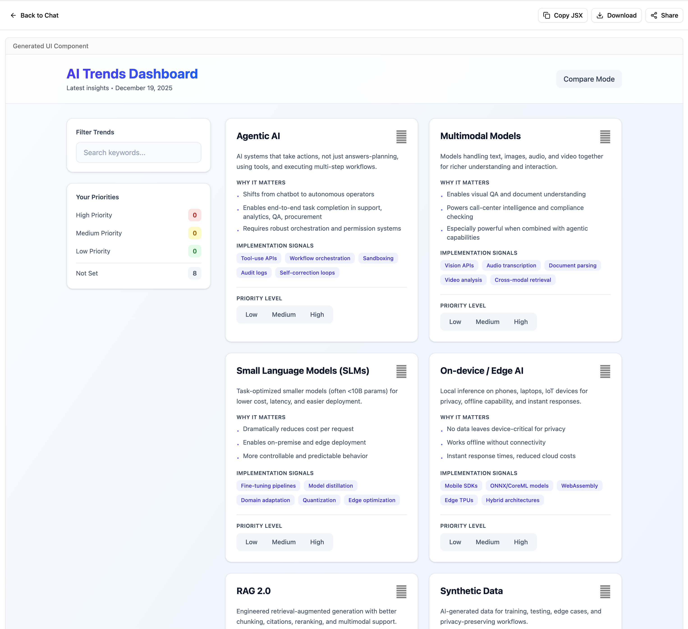

# AI SDK Elements Chatbot

A multi-tool agentic chatbot built with React and the AI SDK

## Technologies Used

- [Vite](https://vite.dev/)
- [TypeScript](https://www.typescriptlang.org/)
- [Express](https://expressjs.com/)
- [React](https://react.dev/blog/2024/12/05/react-19)
- [AI SDK](https://ai-sdk.dev/)
- [AI Elements](https://ai-sdk.dev/elements)

## Getting Started

### Prerequisites

- Node.js 24 (provided via nvm)
- npm or yarn

### Installation

1. Clone this repository
2. Install dependencies:

```bash
npm install
```

3. Start the development server:

```bash
npm run dev
```

This will start both the frontend and backend servers using concurrently.

- The React frontend will be available at: http://localhost:5173
- The Express API runs at: http://localhost:1753

## Screenshots


---


---


---


