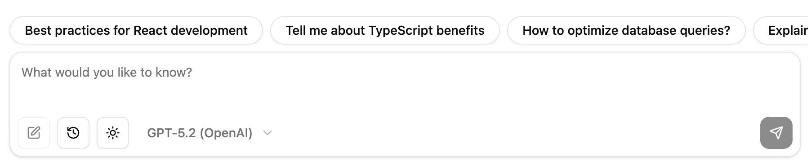
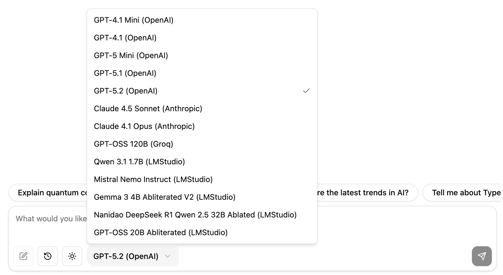
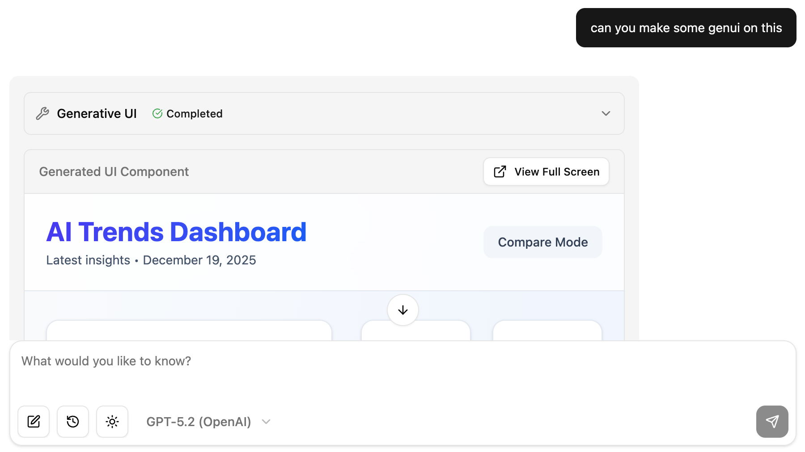

# AI SDK Elements Chatbot

A multi-tool agentic chatbot built with React and the AI SDK

## Technologies Used

- Vite
- TypeScript
- Express
- React
- AI SDK
- AI Elements

## Getting Started

### Prerequisites

- Node.js 24 (provided via nvm)
- npm or yarn

### Installation

1. Clone this repository
2. Install dependencies:

```bash
npm install
```

3. Start the development server:

```bash
npm run dev
```

This will start both the frontend and backend servers using concurrently.

- The React frontend will be available at: http://localhost:5173
- The Express API runs at: http://localhost:1753

## Screenshots



---



---



---


